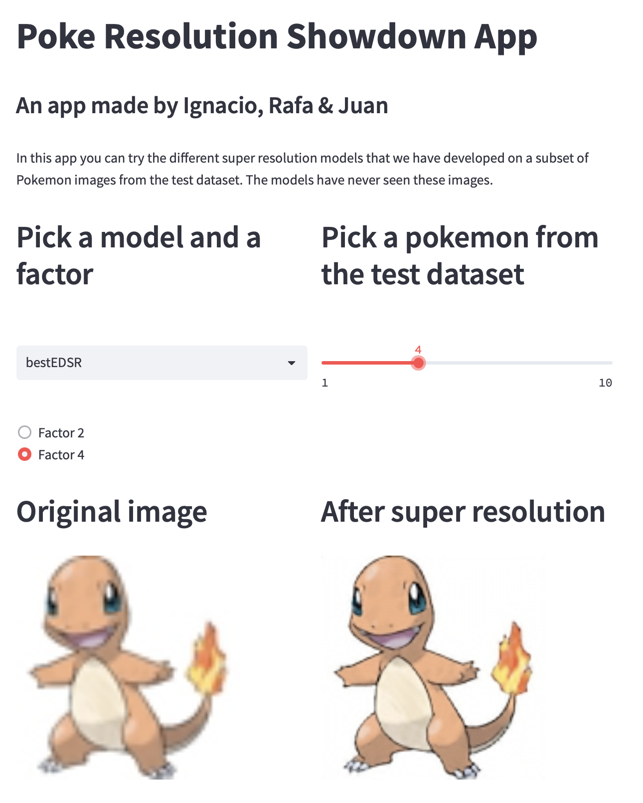
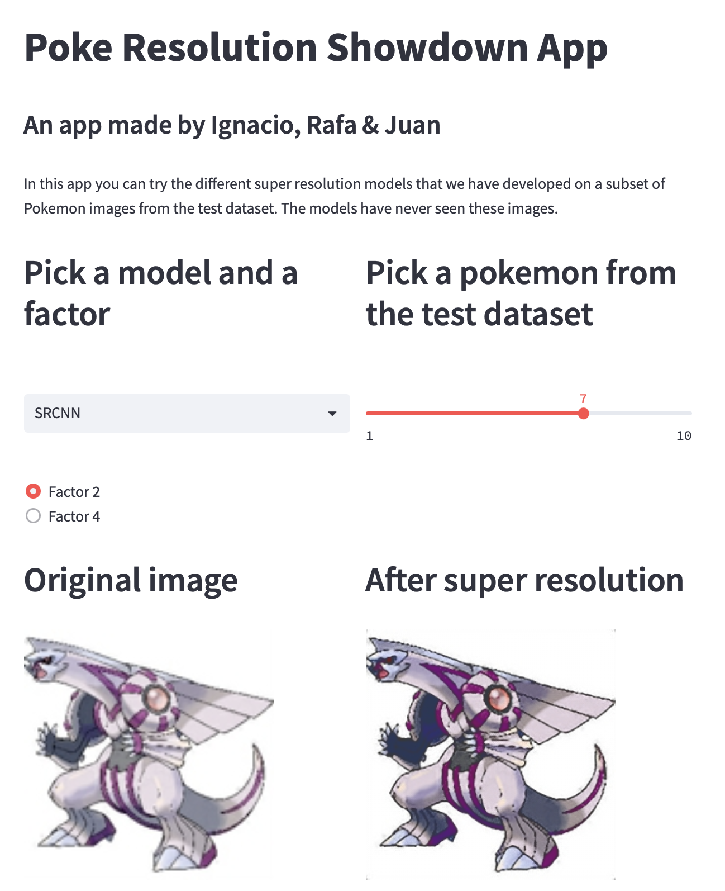

<h1 align="center">
  <br>
  PokeResolution
  <br>
</h1>

<h2 align="center">No Pokemon shall be blurred</h2>

Repository for the Super Resolution project of group 3 for the class of Deep Learning for Visual Recognition, in Aarhus University. 

## Installation
We work with a Conda environment that can be reproduced using the `environment.yml` file that we include. To create a Conda environment capable of running the code in this repository, use the following commands. 

```bash
conda env create -f environment.yml
conda activate PokeRes
```

If you are running the repo from a server or a computer with a GPU, and you want to train some of the models, you should install `environment_cuda.yml` instead.
```bash
conda env create -f environment_cuda.yml
conda activate PokeRes
```

## Dataset
The dataset used for the model is available on [Kaggle](https://www.kaggle.com/datasets/kvpratama/pokemon-images-dataset). Special thanks to [kvpratama](https://www.kaggle.com/kvpratama) for sharing it to the open-source community.

## Models
The following models are available:

- SRCNN: The SRCNN model proposed on the [paper](https://link.springer.com/chapter/10.1007/978-3-319-10593-2_13)
- ourSRCNN: A model inspired by SRCNN and [FSRCNN](https://link.springer.com/chapter/10.1007/978-3-319-46475-6_25)


- EDSR: Enhanced Deep Super Resolution, a residual network model proposed on this [paper](https://ieeexplore.ieee.org/document/8014885) with some minor adjustments


## Dashboard
To visualize the super-resolution models that we have obtained, you can use our Streamlit Dashboard app. For building it locally, follow these commands.

```bash
streamlit run app.py
```

There, you can choose the model and the factor of upscaling that you want to visualize, and pick a random Pokemon from the test dataset (which has not been seen by any of the models in the training phases). 

<table  cellspacing="0" cellpadding="0"><tr>
<td>  </td>
<td>  </td>
</tr></table>